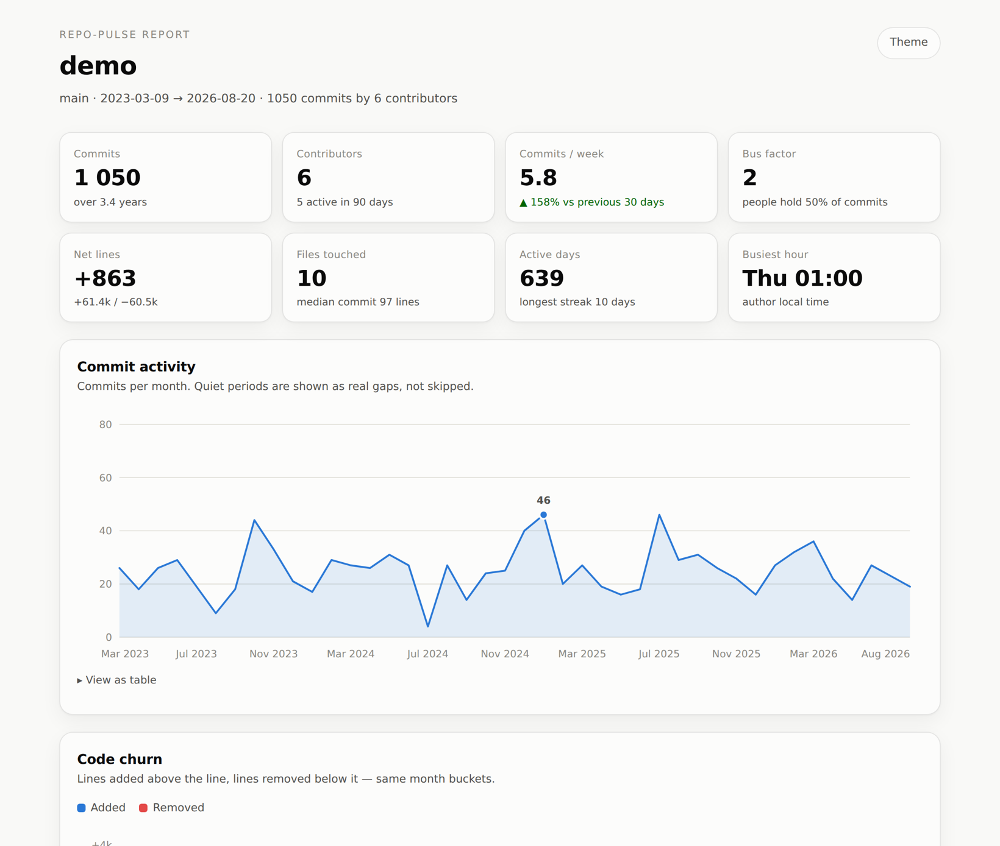

<div align="center">

# repo-pulse

**Point it at any git repository. Get back a single HTML file that tells you what actually happened.**

[](https://github.com/Giochvanno/repo-pulse/actions/workflows/ci.yml)
[](pyproject.toml)
[](LICENSE)
[](pyproject.toml)

<!-- After publishing to PyPI, add:
[](https://pypi.org/project/repo-pulse/)
-->

</div>

```bash
pipx install git+https://github.com/Giochvanno/repo-pulse
repo-pulse . --open
```

That's it. No API token, no config file, no third-party packages — `repo-pulse` reads
`git log` and writes one self-contained HTML file you can email, commit, or publish to
GitHub Pages.

> Plain `pip install repo-pulse` lands once the first release is published; until then
> install from source with the command above (or `pip install .` in a clone).

<div align="center">
  
</div>

## Why

`git log` knows everything about your project and tells you none of it. GitHub Insights
shows a fraction, only for repos hosted there, only for the default branch, and never for
that private client repo you inherited last week.

`repo-pulse` answers the questions you actually ask when you open an unfamiliar codebase:

- Is this project alive, or was the last real work two years ago?
- Who wrote it — and how badly are we exposed if that person leaves?
- Which files churn constantly? Which ones has nobody touched in a year?
- When does the team actually commit? (The Sunday-23:00 column tells its own story.)

## What you get

| | |
|---|---|
| **Activity timeline** | Commits per day/week/month, auto-bucketed to the repo's lifespan. Quiet periods show as real gaps, not skipped ticks. |
| **Churn** | Lines added above the baseline, removed below it. |
| **Contributors** | Ranked by commits, with share, active days, and first/last seen. |
| **Rhythm heatmap** | Weekday × hour, in each author's own timezone. |
| **Hot files** | Most-churned paths, with lockfiles and `vendor/` filtered out by default. |
| **Risk report** | Bus factor, top-author concentration, single-owner files, hot-but-abandoned files. |

Every chart works in light and dark mode, has a hover tooltip, and ships with a
"View as table" fallback — the palette is validated for colour-vision deficiency, so
nothing depends on colour alone.

## Usage

```bash
repo-pulse                          # current directory → <repo>-pulse.html
repo-pulse ~/code/api --open        # write and open in the browser
repo-pulse https://github.com/psf/requests   # clone URL: fetched to a temp dir first
repo-pulse . --days 90              # only the last quarter
repo-pulse . --since "2024-01-01" --until "2024-12-31"
repo-pulse . -b develop -n 20       # another branch, 20 rows per ranking
repo-pulse . -f text                # quick summary in the terminal
repo-pulse . -f json -o pulse.json  # machine-readable metrics for CI
```

<details>
<summary><b>Terminal output (<code>-f text</code>)</b></summary>

```text
  my-project  (main)
  2023-02-14 → 2026-08-19  ·  1282 days

  commits            1147   (6.3/week)
  contributors         18   (7 active in 90d)
  files touched       412
  lines           +184.2k / -96.4k
  bus factor            3   (Ada Chen, Ivan Petrov, Mei Tanaka)
  busiest        Tue 11:00

  activity per week
  ▂▃▅▂▁▃█▆▄▃▂▁▁▂▄▅▃▂▂▃▅▇▆▃▂▁▂▃▄▂

  top contributors
    Ada Chen                 312  ███████ 27.2%
    Ivan Petrov              244  ██████ 21.3%
```

</details>

### All options

```
positional:
  path                  local path to a git repository, or a clone URL (default: .)

options:
  -o, --output FILE     output file (default: <repo>-pulse.html)
  -f, --format {html,json,text}
  -n, --top N           rows per ranking (default: 10)
  --days N              only analyse the last N days
  --since DATE          git date, e.g. 2024-01-01 or '6 months ago'
  --until DATE          upper bound
  -b, --branch REV      branch or revision range
  --max-commits N       stop after N commits (useful on huge repos)
  --include-merges      count merge commits too
  --include-noise       keep lockfiles and vendor/ in file rankings
  --open                open the report in your browser
  -q, --quiet           print nothing but errors
```

## Use it in CI

Publish a fresh report on every push to `main`:

```yaml
- uses: actions/checkout@v4
  with: { fetch-depth: 0 }        # repo-pulse needs the full history
- run: pip install repo-pulse   # or: pip install git+https://github.com/Giochvanno/repo-pulse
- run: repo-pulse . -o public/index.html
- uses: actions/upload-pages-artifact@v3
  with: { path: public }
```

Or fail a PR when the bus factor drops:

```bash
repo-pulse . -f json | python -c "import json,sys; \
  sys.exit(json.load(sys.stdin)['risks']['bus_factor'] < 2)"
```

## How it works

One `git log --numstat` call, parsed with the standard library, aggregated into metrics,
rendered as hand-written SVG. No plotting library, no browser engine, no network access —
which is also why it runs on a private repo without anything leaving your machine.

```
src/repo_pulse/
├── gitlog.py    # git log → Commit objects (mailmap-aware, rename-aware)
├── analyze.py   # commits → metrics (timeline, authors, files, risk)
├── charts.py    # metrics → inline SVG
├── report.py    # metrics + SVG → one HTML file
└── cli.py       # argparse, text and JSON output
```

## Development

```bash
git clone https://github.com/Giochvanno/repo-pulse
cd repo-pulse
pip install -e ".[dev]"
pytest
python scripts/make_demo_repo.py /tmp/demo && repo-pulse /tmp/demo -o docs/demo.html
```

## Contributing

Issues and PRs are welcome — especially new metrics. Keep the zero-dependency rule: if it
needs a package at runtime, it doesn't go in.

## License

MIT © Arman ([@Giochvanno](https://github.com/Giochvanno))
